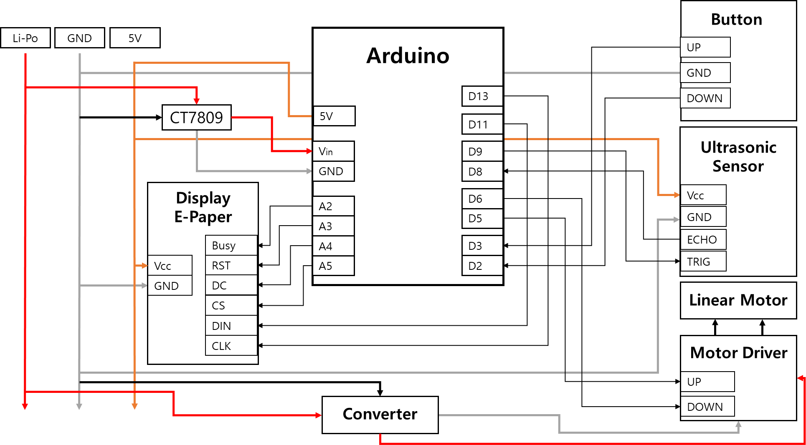

# exec 폴더 정리

이벤트 시간: 2023년 8월 18일

### 1.  사용한 JVM, 웹서버, WAS 제품 등의 종류와 설정값, 버전(IDE버전 포함) 기재

- IoT

| Board | Arduino UNO R4 WIFI | https://www.arduino.cc/ 설치 후 이용 |
| --- | --- | --- |
|  | Raspberry PI 4 | https://www.raspberrypi.com/software/ 설치 후 CLI 환경에서 사용 |
| IDE | Arduino IDE 2.1.1 | https://www.arduino.cc/en/software/ |
| Library | ArduinoHttpClient(0.5.0) | https://github.com/arduino-libraries/ArduinoHttpClient |
| Module | 2.9inch e-paper module | https://www.waveshare.com/wiki/2.9inch_e-Paper_Module_Manual#Working_With_Arduino 설치 후 사용 |
| |  RFID | sudo raspi-config // 해당 창으로 이동
|||Interface Options 선택
|||SPI 선택 후 해당 내용 enable
|||lsmod | grep spi // 입력 후 spi_bcm2835 나온다면 성공
|||sudo apt-get install python3-dev python3-pip
|||sudo pip3 install spidev
|||sudo pip3 install mfrc522 설치 후 이용 |
- Backend

| OS | Ubuntu, Window 10 |
| --- | --- |
| Server | AWS EC2 Ubuntu 20.04 LTS |
| Database | MySQL |
| IDE | IntelliJ |
| Build Tool | Gradle |
| Framework | Spring Boot |
| Communication Protocol | HTTP(for REST), WebSocket |
| Language | Java(Kotlin) |
- App

| OS | Android OS |
| --- | --- |
| SDK Version | min SDK 24
target SDK  33 |
| Language | Java  SE 17 |
| IDE | Android Studio Flamingo | 2022.2.1 |
| Communicationo Protocol | HTTP (Retrofit2) |
| Test Virtual Device Manager | Pixel 4 API 30 |

### 2. 빌드 시 사용되는 환경 변수 등의 주요 내용 상세 기재

- 서버 베포
    
    ```bash
    cd BackEnd/HJJ_restful_server  // 서버 폴더로 이동
    chmod +x gradlew  // gradlew에 권한 부여
    ./gradlew build  // 빌드
    cd build/libs
    nohup java -jar HJJ_restful_server-0.0.1-SNAPSHOT.jar &
    	// 백그라운드에서 서버 실행
    ```
    
- 앱 배포
    
    ```markdown
    1. JDK 설치 및 경로 설정
    2. Android Studio 설치
    3. ./SmartDesk 프로젝트 Open
    4. 스마트폰 <> PC 연결
    5. Run 'App'
    ```
    
- IoT 배포
    - Arduino
        1. Arduino IDE 설치
        2. Boards Manager - Arduino UNO R4 Boards 설치
        3. Library Manager - ArduinoHttpClient 설치
        4. `src.ino` 파일의 <tableID> 변경
            
            ```cpp
            #define TABLE_ID <tableID>
            ```
            
        5. `arduino_secrets.h` 파일의 <ssid>, <password> 변경
            
            ```cpp
            #define SECRET_SSID <ssid>
            #define SECRET_PASS <password>
            ```
            
        6. 아래와 같이 모듈 연결
            
            
            
    - Raspberry PI
        1. Raspberry PI OS 설치
            
            [`https://www.raspberrypi.com/software/`](https://www.raspberrypi.com/software/)
            
        2. Raspberry PI 부팅 시 프로그램 자동 실행
            
            ```bash
            sudo vi /etc/rc.local 
            // 해당 파일에서 exit 0 바로 윗줄에 아래 코드 추가
            	sudo python3 /home/pi/RFIDlast.py&
            ```
            
        3. `Raspberry PI` 폴더의 [`RFIDlast.py`](http://RFIDlast.py) 파일의 Auth_Card 배열 안의 카드ID를 사용하고자 하는 카드들에 대한 ID로 변경
        4. 아래와 같이 모듈 연결
            
            
            

### 3. DB 접속 정보 등 프로젝트(ERD)에 활용되는 주요 계정 및 프로퍼티가 정의된 파일 목록

- DB 계정

```bash
DB username : DAY6
DB password : 111111
```

- application.properties

```java
spring.jpa.hibernate.naming.physical-strategy = org.hibernate.boot.model.naming.PhysicalNamingStrategyStandardImpl
```

- application.yml

```markup
# database 연동 설정
spring:
  datasource:
    driver-class-name: com.mysql.cj.jdbc.Driver
    #    각자 PC에 만들어놓은 Database이름을 써야 합니다.
    url: jdbc:mysql://i9A301.p.ssafy.io:3306/SERVER?serverTimezone=Asia/Seoul&characterEncoding=UTF-8
    #    mysql에 생성한 사용자 계정 정보를 써야 합니다.
    username: DAY6
    password: ****** # 자신의 mysql 비밀번호
  thymeleaf:
    cache: false

  # spring data jpa 설정
  jpa:
    database-platform: org.hibernate.dialect.MySQL57Dialect
    open-in-view: false
    show-sql: true
    hibernate:
      ddl-auto: update
```

### 4. 시연 시나리오

- 시연 순서에 따른 site 화면별, 실행별 (클릭 위치 등 ) 상세 설명
1. `자동 예약 기능` 토글 끄고 로그아웃이 된 상태에서 시작
2. `출근 태그` 하고(LED를 통해 작동을 확인) `초기 로그인`을 하고 `예약 페이지로 이동`
3. 자동 예약 기능 `토글 키고 앱을 껐다 킴`.
4. `자동 로그인, 자동 좌석 예약 팝업` 뜨고 자동 예약이 됨.
5. 수동으로 높이 조절(위로)
6. `내 정보에서 즐겨찾는 책상 높이 변경`
7. 수동으로 다시 높이 조절(아래로)
8. `어플로 즐겨찾는 높이로 조정`
9. 캘린더에서 `일정 추가`. 홈 화면에 일정 추가된다.
10. 시작 시간이 되면 `전자 잉크에 자리비움`으로 뜨고 `앱에서도 자리비움`으로 뜬다.
11. 끝나는 시간이 되면 `전자 잉크에 present`로 뜨고 `앱도 초록색`으로 바뀜.
12. 퇴근 -> 전자잉크 꺼짐
13. 정해진 시간이 되면 높이 초기화 됨.